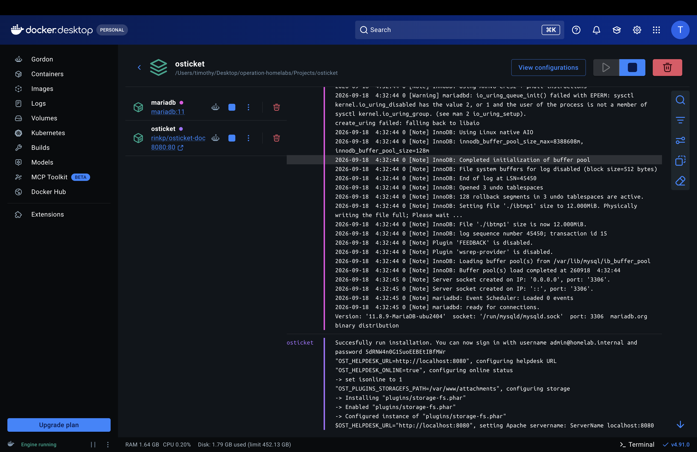

# 01 — Docker and repository setup

### Objective

Get a repeatable local ops environment: Docker Desktop running, a repo layout that separates each service, secrets kept out of Git, and a place to drop evidence.

### Why this matters

Help Desk and Cloud Support work is not “install an app.” It is: isolate a service, know where its state lives, know what is safe to commit, and be able to rebuild it. If the lab is a single mystery container started from memory, there is nothing to show a hiring manager except that Docker Desktop launched.

### What I implemented

- Docker Desktop as the runtime (Personal / Engine running).
- One Git repo with service folders instead of a single compose soup:
  - `Projects/osticket/` — help desk + database
  - `Projects/lldap/` — identity directory (deployed; see [04](04-lldap-identity.md))
  - `Projects/uptime-kuma/` — monitoring (not started)
  - `Projects/docs/` — this case study
  - `Projects/evidence/screenshots/` — captures
- `.gitignore` rules for `.env`, logs, backups, and `secrets/`.
- `.env.example` files with placeholders so someone else can recreate the stack without copying live credentials.

### Procedure

```text
docker compose --env-file .env config >/dev/null   # interpolation works, secrets not printed
docker compose --env-file .env up -d
docker compose ps
docker volume ls
```

The `--env-file` flag is deliberate. Compose will load a local `.env` automatically, but making the file explicit is the habit that survives when the working directory is wrong or CI has no implicit dotenv.

### Verification

- Docker Desktop shows the `osticket` project with `mariadb` and `osticket` containers.
- `docker compose ps` shows MariaDB `healthy` and osTicket publishing `127.0.0.1:8080->80/tcp`.
- `.env` is not tracked by Git. `.env.example` is.

### Evidence to capture

| File | What it must prove |
| --- | --- |
| `evidence/screenshots/Docker_Stack_Running.png` | Both services exist in the osticket project; osTicket is on `8080:80`. |
| `evidence/screenshots/Container-healthy.png` | Named volumes exist; `compose ps` shows health and the localhost publish. |



**What this proves:** the stack is a Compose project, not two unrelated containers. MariaDB has no host port. osTicket is the only published service.

### Troubleshooting / lessons learned

`screencapture` from the osticket directory failed (`could not create image from display`). That is a local macOS / permissions issue, not a stack issue. I captured from Docker Desktop and from the terminal window instead of pretending the first command worked.

`docker compose config` prints interpolated secrets. The safer check is redirecting it to `/dev/null` after confirming the required variable *names* exist:

```text
grep -E '^OST_' .env | cut -d= -f1
docker compose --env-file .env config >/dev/null && echo "Compose configuration OK"
```

### Security / operational considerations

- `.env` stays local. Git only gets `.env.example`.
- Publishing `127.0.0.1:8080:80` keeps the help desk off the LAN. `8080:80` without the bind address would expose it to every machine on the network, which is a sloppy default on a laptop.
- MariaDB has no `ports:` mapping. The database is reachable from the osTicket container on the Compose network, not from the host’s 3306. That is least privilege for a workstation lab.

### Production delta

A business environment would not leave secrets in a file on a laptop. Use a secret manager or at least a sealed store, pin images by digest, put a reverse proxy and TLS in front of the desk, and run this on an internal network rather than a developer workstation. The repo layout still holds: one service directory, one contract file, one secret template.

### Interview talking point

I did not start osTicket with `docker run`. I defined the help desk as a Compose contract: secrets injected, database unpublished, app bound to localhost, and state on named volumes so I could reason about persistence and rebuilds.
