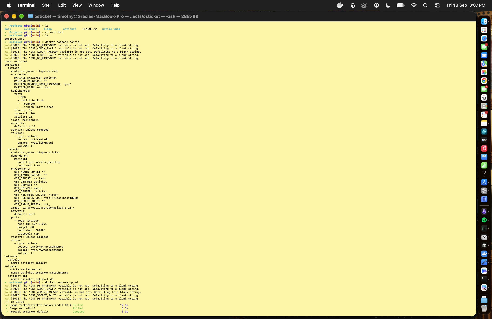
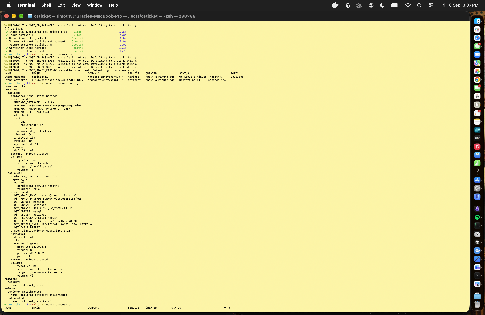
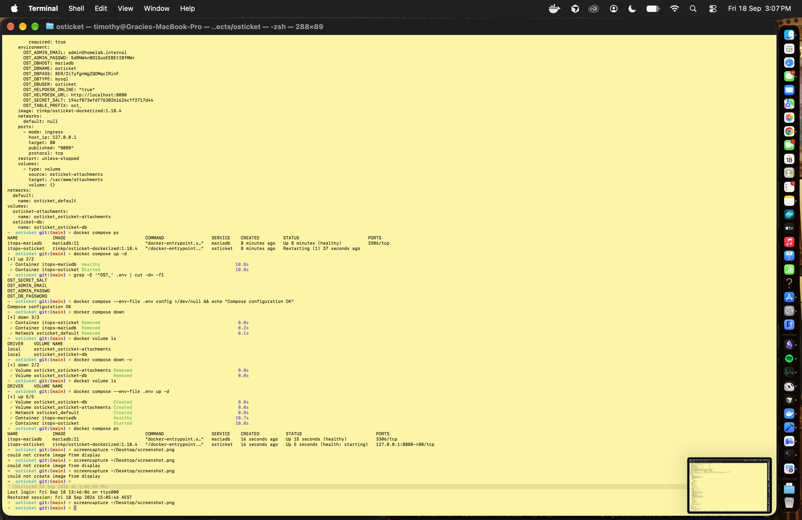
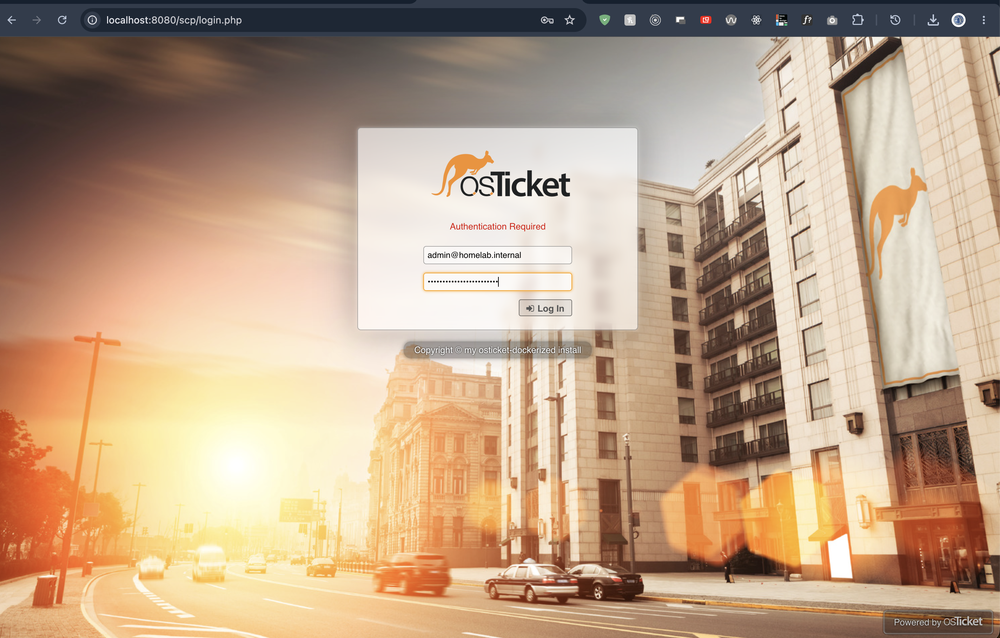

# 02 — osTicket deployment

osTicket + MariaDB so agents can log in and users can file tickets. First `up` failed because secrets never reached the containers.

## Compose

```1:45:Projects/osticket/compose.yaml
services:
  mariadb:
    image: mariadb:11
    container_name: itops-mariadb
    environment:
      MARIADB_RANDOM_ROOT_PASSWORD: "yes"
      MARIADB_DATABASE: osticket
      MARIADB_USER: osticket
      MARIADB_PASSWORD: ${OST_DB_PASSWORD}
    volumes:
      - osticket-db:/var/lib/mysql
    healthcheck:
      test: ["CMD", "healthcheck.sh", "--connect", "--innodb_initialized"]
      interval: 10s
      timeout: 5s
      retries: 10
    restart: unless-stopped

  osticket:
    image: rinkp/osticket-dockerized:1.18.4
    container_name: itops-osticket
    depends_on:
      mariadb:
        condition: service_healthy
    environment:
      OST_SECRET_SALT: ${OST_SECRET_SALT}
      OST_ADMIN_EMAIL: ${OST_ADMIN_EMAIL}
      OST_ADMIN_PASSWD: ${OST_ADMIN_PASSWD}
      OST_HELPDESK_URL: http://localhost:8080
      OST_HELPDESK_ONLINE: "true"
      OST_DBTYPE: mysql
      OST_DBHOST: mariadb
      OST_DBNAME: osticket
      OST_DBUSER: osticket
      OST_DBPASS: ${OST_DB_PASSWORD}
      OST_TABLE_PREFIX: ost_
    ports:
      - "127.0.0.1:8080:80"
    volumes:
      - osticket-attachments:/var/www/attachments
    restart: unless-stopped
```

| Choice | Why |
| --- | --- |
| `depends_on` + `service_healthy` | Do not start the app before InnoDB is ready. |
| Healthcheck `--innodb_initialized` | Stronger than “mysqld is listening.” |
| `MARIADB_RANDOM_ROOT_PASSWORD` | App uses the `osticket` user. No reusable root password. |
| Named volumes | Tickets and attachments survive a container recreate. They also survive a *bad* first boot. |
| `rinkp/osticket-dockerized:1.18.4` | Unattended install from env. Version-tagged, not digest-pinned. |

## First boot (this failed)

```text
docker compose config          # WARN: OST_* unset → blank strings
docker compose up -d
docker compose ps              # MariaDB healthy, osticket Restarting
```



Unset `OST_*` vars. Rendered config has empty `MARIADB_PASSWORD` and `OST_DBPASS`. The pull still succeeded.



Database healthy is not the same as the app working. osTicket was looping on auth.

## Fix

MariaDB only applies `MARIADB_USER` / `MARIADB_PASSWORD` when the data directory is empty. Adding `.env` and restarting is not enough if the volume already exists.

```text
# create .env from .env.example
grep -E '^OST_' .env | cut -d= -f1
docker compose --env-file .env config >/dev/null
docker compose down
docker volume ls               # osticket-db still there
docker compose down -v         # drop the volume that init'd with a blank password
docker compose --env-file .env up -d
docker compose ps
```



`down -v`, volumes recreated, then `ps` shows MariaDB healthy and osTicket on `127.0.0.1:8080`.

## Login

Staff console: `http://127.0.0.1:8080/scp/login.php`



Login page on localhost. Lab admin mailbox is `admin@homelab.internal`.

## What I ruled out

| Guess | Result |
| --- | --- |
| Images failed to pull | No. `Pulled` / `Created` succeeded. |
| MariaDB not ready | No. Healthcheck passed; logs said `ready for connections`. The `io_uring` / `EPERM` line on Docker Desktop for Mac is noise — fallback to libaio. |
| Secrets never injected | Yes. `docker compose config` showed empty passwords. |
| Restart after `.env` is enough | No. Init-time config ≠ runtime config. `down -v` was required. |

osTicket can report Docker `unhealthy` while Apache still returns HTTP 200. Use both signals.

In production: secret manager, image digest pin, TLS, tested backups of both volumes, and a healthcheck that hits a real HTTP path.
