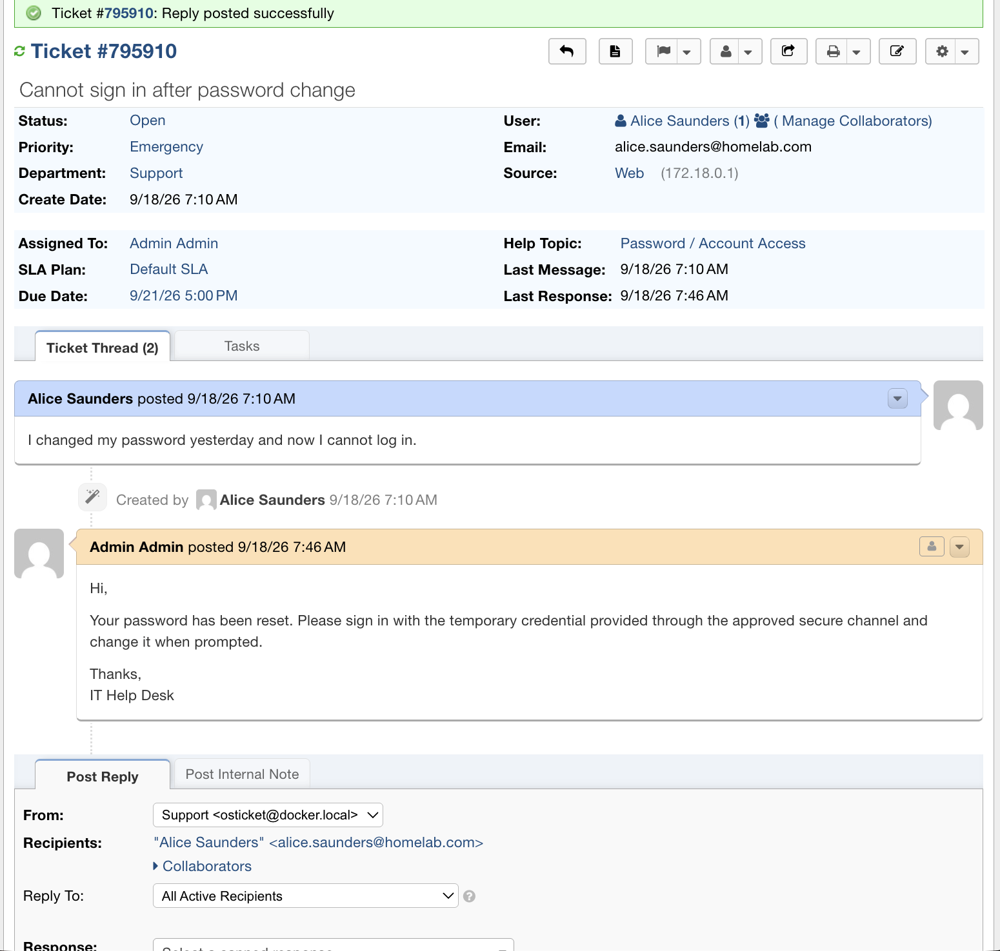
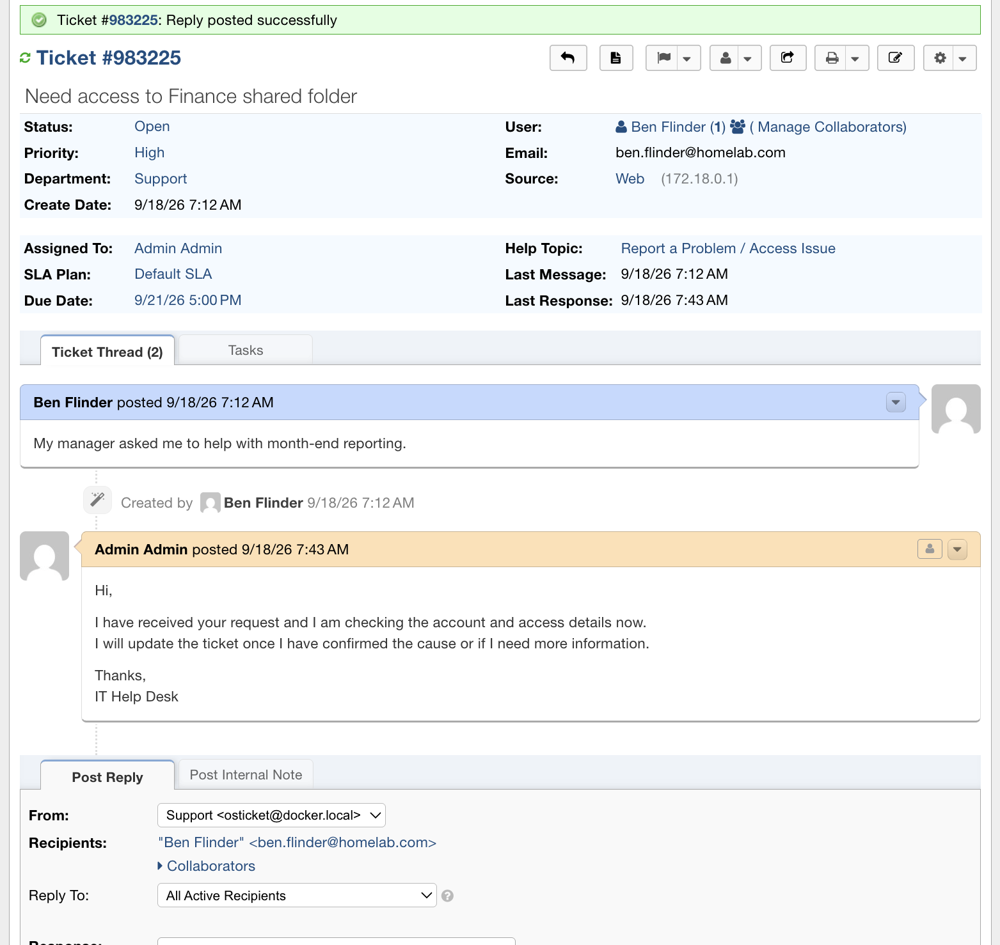
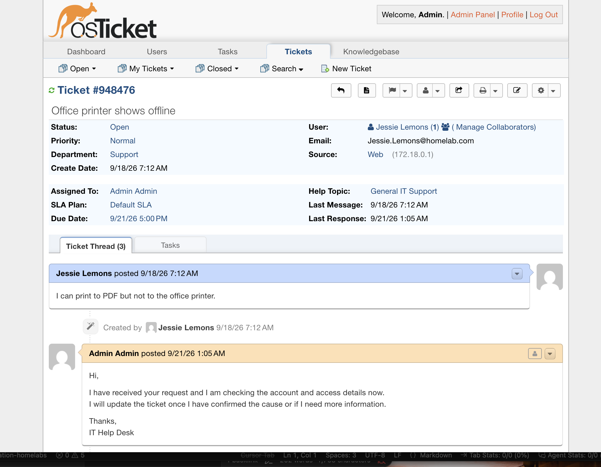

# 03 — Ticket scenarios

The desk was used as a queue: fake employees, real ticket types, claim / note / reply / transfer / close.

## Users

| User | Mailbox | Tickets |
| --- | --- | --- |
| Alice Saunders | `alice.saunders@homelab.com` | Password lockout |
| Ben Flinder | `ben.flinder@homelab.com` | Finance share access |
| Jessie Lemons | `Jessie.Lemons@homelab.com` | Printer offline |
| Timothy Itayi | lab end-user | VPN, then help-desk outage |

Help topics: Password / Account Access, VPN / Remote Access, Report a Problem / Access Issue, General IT Support.

Departments: Support, then Network Support on the VPN ticket.

## VPN — `#344321` Unable to connect to VPN

**Intake:** “VPN worked yesterday. Today I receive a connection timeout from home Wi-Fi.”

Worked yesterday → not an enrollment problem. Home Wi-Fi → check the remote network first.

1. Claimed the ticket.
2. Internal note: cause (stale DNS after ISP reconnect) / action (confirm internet, flush DNS, re-establish VPN) / prevention (restart router; escalate if it repeats).
3. Priority High → Normal after internet was confirmed.
4. Transferred to Network Support.
5. User reply without the internal note.
6. Closed as Resolved.

Thread shows claim, internal note, priority change, department transfer, and the user-facing reply.

A later ticket (`#326898`) came back with the same class of failure. That is a recurrence, not a silent duplicate.

## Password — `#795910` Cannot sign in after password change

**Intake (Alice Saunders):** “I changed my password yesterday and now I cannot log in.”

Emergency is right for a user who cannot sign in at all. The reply says the password was reset and the temporary credential goes through a secure channel — not the ticket body. The directory action is in [04 — LLDAP](04-lldap-identity.md).

No password in the thread. Assigned to Admin. Help topic: Password / Account Access.

## Access — `#983225` Need access to Finance shared folder

**Intake (Ben Flinder):** “My manager asked me to help with month-end reporting.”

This is an access request, not break/fix. High is defensible (time-bound, Finance-scoped).

Reply acknowledges the request. The close-out does not record who approved or which group was granted. Ben’s LLDAP record also has no group memberships — the identity half of this ticket is still missing.

## Printer — `#948476` Office printer shows offline

**Intake (Jessie Lemons):** “I can print to PDF but not to the office printer.”

Print stack works (PDF). Device or queue does not. Assigned and acknowledged; left open until a device check.

## Agent path

1. Open with a help topic that matches the work type.
2. Set priority from impact.
3. Claim. Transfer if it is the wrong team.
4. Internal note = cause / action / prevention. Reply = what the user needs.
5. Resolve when the user can work.
6. Leave recurrences open until the first fix is proven or replaced.

## Notes

- Installer leftover `#511913 osTicket Installed!` clutters the open queue.
- No passwords in ticket bodies.
- Access tickets need an approval record and a group add before they are actually done.
- Outage ticket `#765614` is in [05 — Uptime Kuma](05-uptime-kuma.md).
