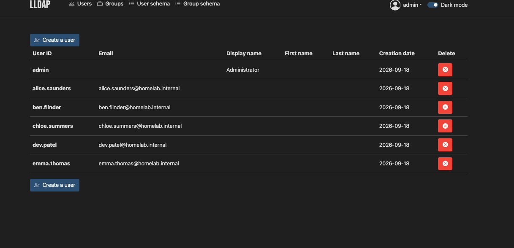
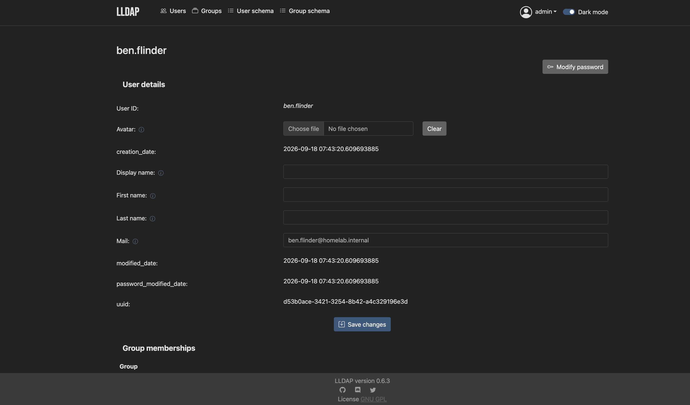

# 04 — LLDAP

Identity store for the lab. osTicket is the queue. LLDAP is where the account change happens.

Admin UI: `http://127.0.0.1:17170`  
LDAP: `127.0.0.1:3890`

## Compose

```1:20:Projects/lldap/compose.yaml
services:
  lldap:
    image: lldap/lldap:stable
    container_name: itops-lldap
    environment:
      TZ: Australia/Melbourne
      LLDAP_JWT_SECRET: ${LLDAP_JWT_SECRET}
      LLDAP_KEY_SEED: ${LLDAP_KEY_SEED}
      LLDAP_LDAP_BASE_DN: dc=homelab,dc=internal
      LLDAP_LDAP_USER_PASS: ${LLDAP_ADMIN_PASSWORD}
    ports:
      - "127.0.0.1:17170:17170"
      - "127.0.0.1:3890:3890"
    volumes:
      - lldap-data:/data
    restart: unless-stopped
```

| Choice | Why |
| --- | --- |
| Separate Compose project | Identity outage and help-desk outage are different blast radii. |
| Base DN `dc=homelab,dc=internal` | Matches the directory mailbox suffix. |
| Ports on `127.0.0.1` | UI and LDAP stay off the LAN. `3890` avoids a privileged 389. |
| JWT secret + key seed in `.env` | Not baked into YAML. |
| Volume `lldap-data` | Users survive a container recreate. |
| `TZ: Australia/Melbourne` | Password-modified timestamps on a real clock. |

## Bring-up

```text
cd Projects/lldap
cp .env.example .env
docker compose --env-file .env up -d
docker compose ps
```

## Users

| User ID | Mailbox |
| --- | --- |
| `alice.saunders` | `alice.saunders@homelab.internal` |
| `ben.flinder` | `ben.flinder@homelab.internal` |
| `chloe.summers` | `chloe.summers@homelab.internal` |
| `dev.patel` | `dev.patel@homelab.internal` |
| `emma.thomas` | `emma.thomas@homelab.internal` |

Alice and Ben match the osTicket personas. The others keep the directory from being a 1:1 copy of the open queue.



Lab employees under `@homelab.internal`, not a lone admin account.

## Password reset

Practiced on `ben.flinder`: open the user, **Modify password**. The new secret does not go in the osTicket thread. Ticket `#795910` (Alice) is the queue record; this UI is the action.



Mailbox, UUID, and Modify password on the account object. Display name / first / last are empty. Group memberships are empty.

## Gaps

- Tickets used `@homelab.com`. The directory uses `@homelab.internal`. Same first names, two suffixes. osTicket is not bound to LDAP.
- Reset was practiced on Ben. Alice is the lockout ticket. Procedure shown; audit link is incomplete.
- Ben has no groups, so the Finance access ticket is not fulfilled in the directory.
- `lldap/lldap:stable` floats. LDAP here is plaintext on localhost.

In production this is Entra ID / AD / Okta, LDAPS, MFA, and a joiner workflow. Password resets attach to the ticket user, not a convenient neighbour.
