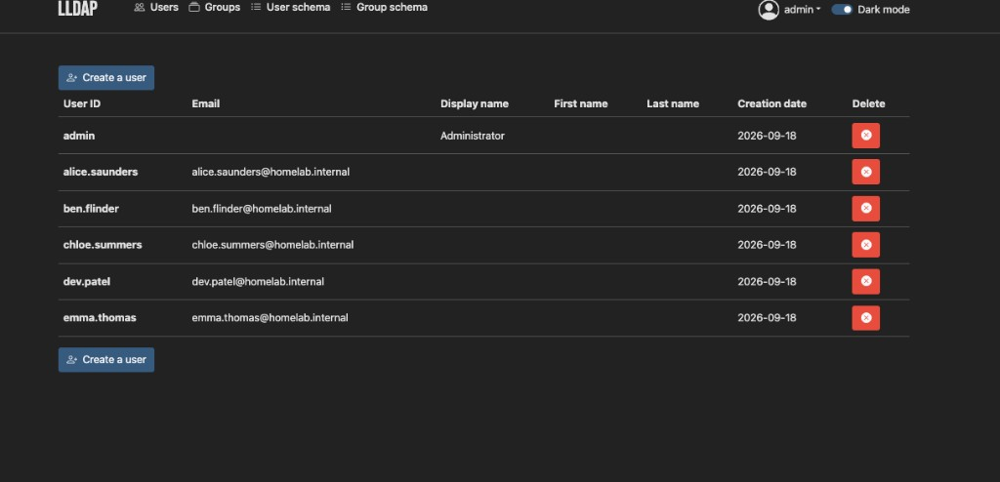
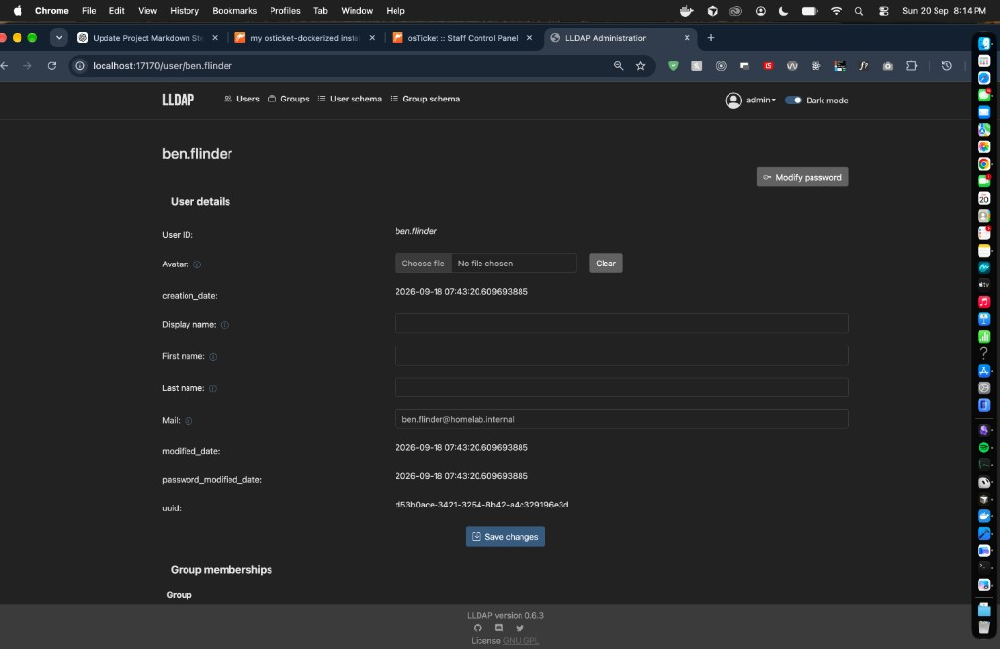

# 04 — LLDAP deploy and identity tasks

### Objective

Stand up a local identity store, create lab employees that match the help-desk personas, and practice the action a password ticket is supposed to trigger: reset the account in the directory, not in the ticket thread.

### Why this matters

osTicket is the queue. It is not the source of truth for who can log in. A Help Desk or Cloud Support engineer who “resolves” a password ticket by typing a new password into the reply is doing the job backwards. The ticket records the request and the communication. The identity system performs the change and holds the audit timestamp.

This is the same split as ServiceNow vs Entra ID, or a ticket vs Active Directory. LLDAP is the lightweight stand-in.

### What I implemented

```1:20:Projects/lldap/compose.yaml
services:
  lldap:
    image: lldap/lldap:stable
    container_name: itops-lldap
    environment:
      TZ: Australia/Melbourne
      LLDAP_JWT_SECRET: ${LLDAP_JWT_SECRET}
      LLDAP_KEY_SEED: ${LLDAP_KEY_SEED}
      LLDAP_LDAP_BASE_DN: dc=homelab,dc=internal
      LLDAP_LDAP_USER_PASS: ${LLDAP_ADMIN_PASSWORD}
    ports:
      - "127.0.0.1:17170:17170"
      - "127.0.0.1:3890:3890"
    volumes:
      - lldap-data:/data
    restart: unless-stopped

volumes:
  lldap-data:
```

| Choice | Why |
| --- | --- |
| Separate Compose project from osTicket | Identity outage should not take the ticket database down with it, and the reverse. Two blast radii. |
| Base DN `dc=homelab,dc=internal` | Matches the mailbox suffix on the directory users. This is the corporate namespace, not `localhost`. |
| Web `127.0.0.1:17170`, LDAP `127.0.0.1:3890` | Admin UI and bind port are both localhost-only. 3890 instead of 389 avoids needing a privileged port on the host. |
| JWT secret + key seed from `.env` | Session tokens and the data-at-rest key are not baked into YAML. |
| Named volume `lldap-data` | Users survive a container recreate. Same persistence lesson as MariaDB, without a SQL server. |
| `TZ: Australia/Melbourne` | Password-modified timestamps are useless if you cannot place them on a clock. |

Directory created (not just `admin`):

| User ID | Mailbox | Why they exist |
| --- | --- | --- |
| `alice.saunders` | `alice.saunders@homelab.internal` | Same persona as ticket `#795910` (cannot sign in after password change). |
| `ben.flinder` | `ben.flinder@homelab.internal` | Same persona as ticket `#983225` (Finance share). Used for the practiced password reset. |
| `chloe.summers` | `chloe.summers@homelab.internal` | Extra staff so the directory is not a 1:1 copy of the open queue. |
| `dev.patel` | `dev.patel@homelab.internal` | Same. |
| `emma.thomas` | `emma.thomas@homelab.internal` | Same. |

### Procedure

```text
cd Projects/lldap
cp .env.example .env          # fill JWT secret, key seed, admin password
docker compose --env-file .env up -d
docker compose ps             # healthy, 127.0.0.1:17170 and :3890
```

Admin UI: `http://127.0.0.1:17170`

Identity tasks practiced:

1. Create users with a stable `user_id` (`firstname.lastname`), not a random display name.
2. Give each user a mailbox under `homelab.internal`.
3. Open a user (`ben.flinder`) and use **Modify password** — the help-desk action for a lockout ticket.
4. Do not write the new password into osTicket. The ticket already said “approved secure channel.” This UI is that channel.

### Verification

- `docker compose ps`: `itops-lldap` healthy, both ports bound to `127.0.0.1`.
- UI lists `admin` plus the five lab users.
- User record for `ben.flinder` shows mailbox `ben.flinder@homelab.internal` and a **Modify password** control. UUID is present (the object is a real directory entry, not a spreadsheet row).

### Evidence



**What this proves:** the identity store is populated with lab employees, not a lone admin account. `alice.saunders` and `ben.flinder` exist as directory objects that can back the osTicket personas.



**What this proves:** the password-reset surface is on the user object. The mailbox is a lab address. The action is “modify password on this account,” not “paste a password into the ticket.”

### Troubleshooting / lessons learned

**osTicket and LLDAP do not share a mailbox suffix.** Tickets were filed as `@homelab.com`. The directory is `@homelab.internal` because that matches `dc=homelab,dc=internal`. That is a real identity defect. Until those UPNs match — or osTicket binds to LDAP — the help desk and the directory are two lists that happen to use the same first names.

**I reset Ben, not Alice.** Ticket `#795910` was Alice’s lockout. The practiced reset is on `ben.flinder`. The *skill* is demonstrated. The *audit trail* is not closed: a supervisor cannot point at Alice’s ticket and Alice’s `password_modified_date` and call it one change. Next capture should be Alice’s user object after reset, with a timestamp that is later than create.

**Display name / first / last are empty** on the Ben record. A directory used for anything beyond a password click needs those attributes. Group memberships on that page are also empty — so ticket `#983225` (Finance share) is still not fulfilled in the identity system. Closing an access ticket without a group add is role-play.

**`lldap/lldap:stable` is a floating tag.** Today it is v0.6.2. Tomorrow it is whatever upstream ships. Same class of risk as an unpinned osTicket image.

### Security / operational considerations

- LDAP `3890` is plaintext LDAP on localhost. Fine for a destroyed laptop lab. Production is LDAPS, or LDAP only on an internal network behind a TLS proxy.
- Admin (`admin`) is a privileged directory account. It should not be the same password as osTicket admin, and it should not appear in a ticket.
- JWT secret and key seed rotate the way MariaDB passwords do: change them after the volume exists and you can lock yourself out of the data. Treat `lldap-data` as stateful.
- Password resets belong in the directory audit fields, not in Slack, not in the ticket body.

### Production delta

| Lab | Business environment |
| --- | --- |
| LLDAP on a laptop | Entra ID, AD, or Okta. Password policy, lockout, MFA, SSO. |
| Manual user create in the UI | Joiner workflow from HR. No one-off clicks without a ticket number. |
| Reset practiced on a convenient user | Reset the *ticket* user, attach the directory event / ticket ID. |
| No groups on Ben | Access request → approved group → time-bound membership. |
| Port 3890 on localhost | LDAPS 636, or a connector from the help desk. |
| `@homelab.com` vs `@homelab.internal` | One UPN suffix, everywhere. |

osTicket is **not** bound to LLDAP yet. Users in the desk and users in the directory are correlated by naming convention only. Wiring bind/auth is a later step, not something this evidence claims.

### Interview talking point

The password ticket is closed in osTicket without a password in the thread. The actual change happens in LLDAP on the user object. That is the Help Desk pattern: ticket for the conversation, directory for the credential. The gap I would own in the interview is that I demonstrated the reset on Ben while Alice was the lockout ticket — same procedure, incomplete audit link.
