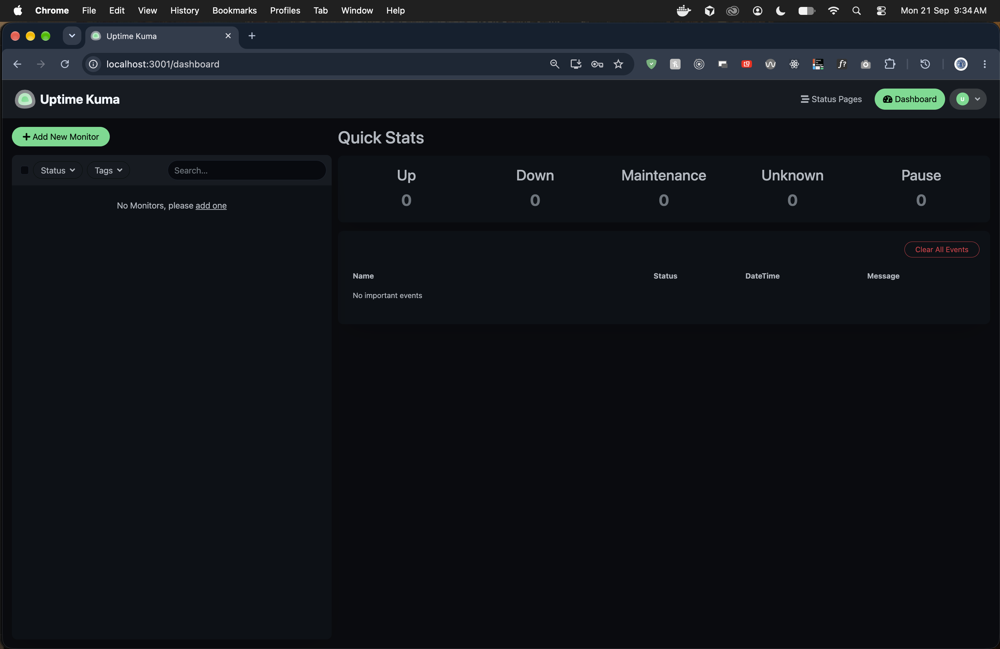
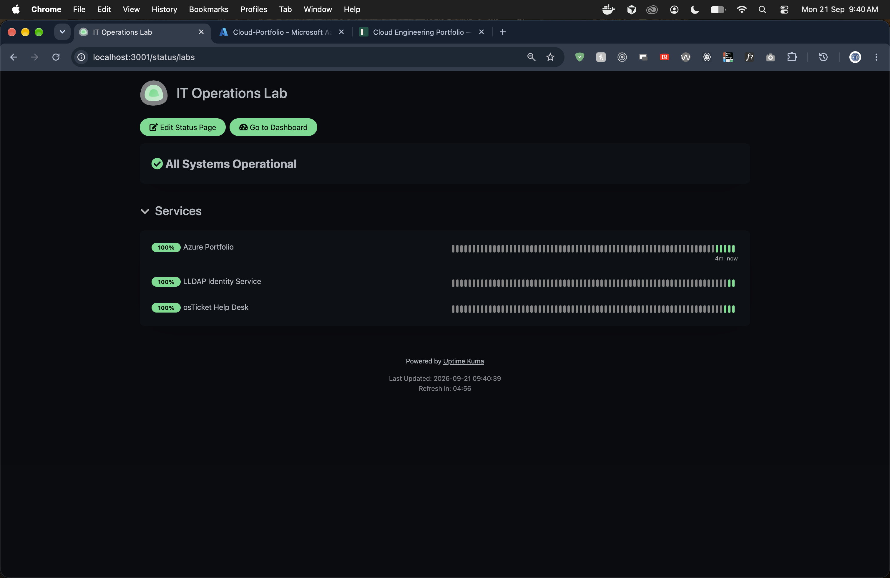
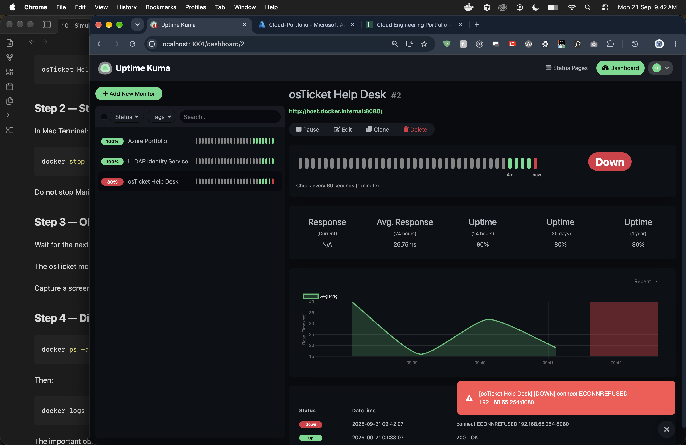
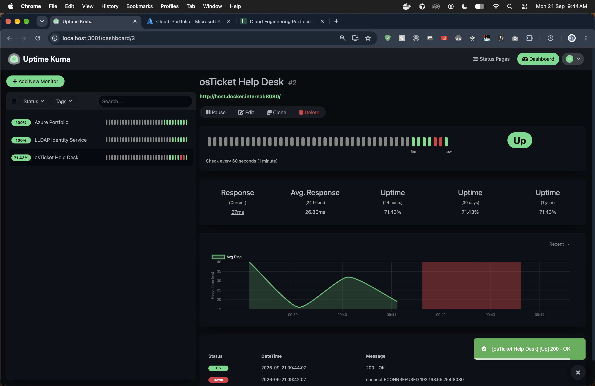
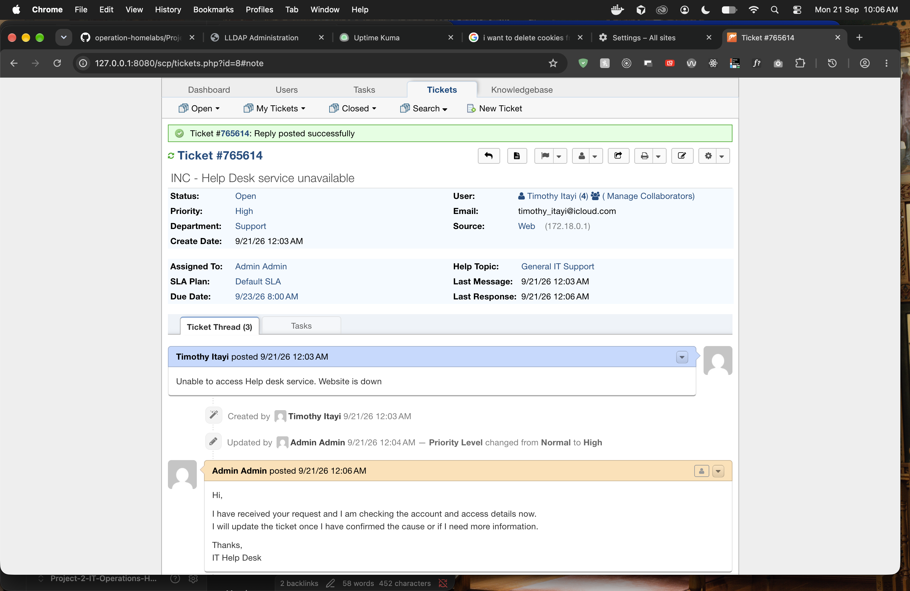
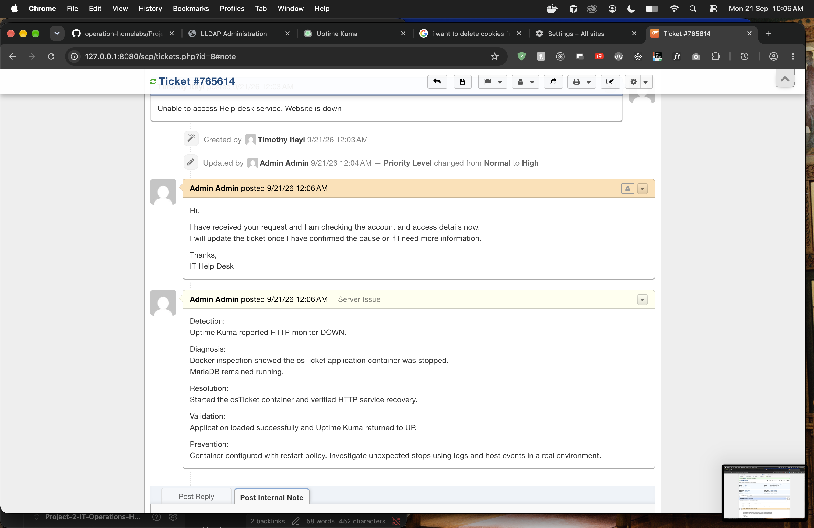

# 05 — Uptime Kuma and the help-desk outage

Kuma watches the local services (and an Azure portfolio site). osTicket was stopped on purpose, the monitor went DOWN, the container was started again, and the outage was written up as a ticket.

UI: `http://127.0.0.1:3001`  
Status page: `http://127.0.0.1:3001/status/labs`

## Compose

```1:10:Projects/uptime-kuma/compose.yaml
services:
  uptime-kuma:
    image: louislam/uptime-kuma:2
    container_name: itops-uptime-kuma
    ports:
      - "127.0.0.1:3001:3001"
    volumes:
      - uptime-kuma-data:/app/data
    restart: unless-stopped
```

No secrets in this file. State is the `uptime-kuma-data` volume (monitors and the status page).

```text
cd Projects/uptime-kuma
docker compose up -d
```

## Monitors

| Monitor | What it checks |
| --- | --- |
| Azure Portfolio | External HTTPS |
| LLDAP Identity Service | Local identity UI |
| osTicket Help Desk | `http://host.docker.internal:8080` every 60s |

`host.docker.internal` is how the Kuma container reaches a service published on the host. From inside the Kuma network, `localhost:8080` would be Kuma itself.



Fresh install: no monitors yet.



Public status page at `/status/labs`. All three checks green after monitors were added.

## Simulated outage

osTicket was stopped. MariaDB was left running — the outage is the app, not the whole stack.

```text
docker stop itops-osticket
# wait for the 60s check
docker start itops-osticket
```



DOWN. Message: `connect ECONNREFUSED 192.168.65.254:8080` (Docker Desktop VM path to the published port). Azure and LLDAP stayed up. osTicket uptime dropped to 80%.



After `docker start`: `200 - OK`. The red gap on the chart is the outage window.

## Ticket `#765614` — Help Desk service unavailable

**Intake:** “Unable to access Help desk service. Website is down.”  
Priority raised Normal → High. Assigned to Admin.



User report plus an acknowledgement. The useful part is the internal note.



| Field | What went in the ticket |
| --- | --- |
| Detection | Uptime Kuma HTTP monitor DOWN |
| Diagnosis | `docker` inspection: osTicket container stopped; MariaDB still running |
| Resolution | Started the osTicket container |
| Validation | App loaded; Kuma returned to UP |
| Prevention | Container already has `restart: unless-stopped`. In a real environment, check logs and host events for unexpected stops |

The user-facing reply and the internal note are different on purpose. The user gets “we are on it.” The note is what the next technician reads.

## Notes

- Stopping the app container is a clean lab outage. A real incident is usually disk, OOM, or a bad deploy.
- Kuma proving DOWN/UP is the monitor. The ticket is the operational record. Neither replaces the other.
- Status page is localhost-only here. A public status page would sit behind auth or a separate hostname.
